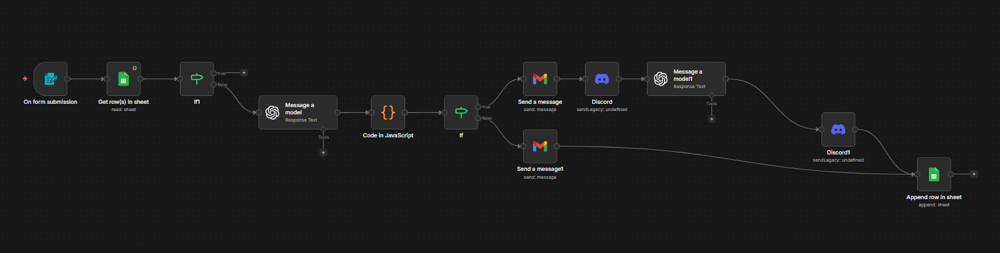
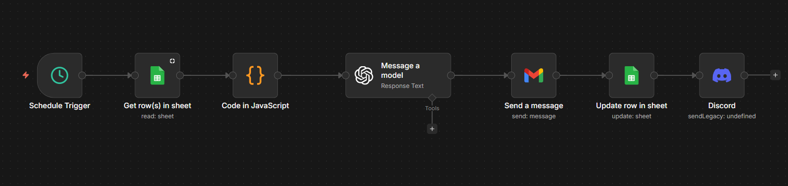
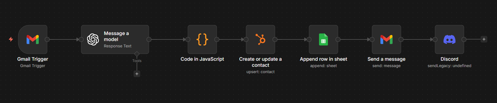
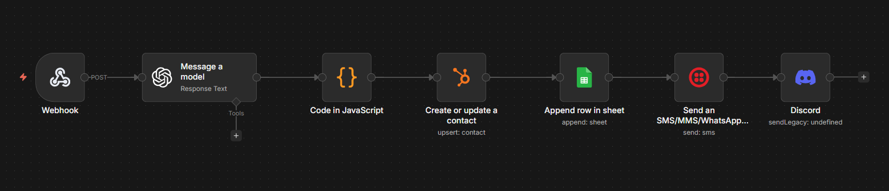
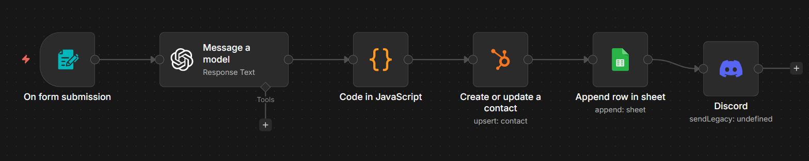
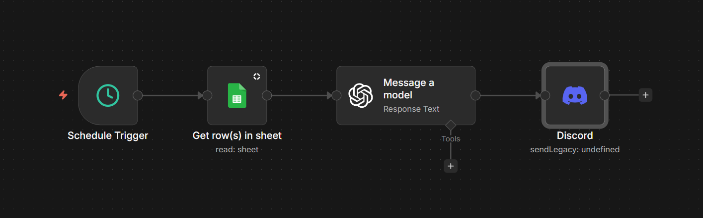

# AI Lead Qualification & Sales Automation System

An end-to-end AI-powered lead qualification and sales automation system built with n8n, GPT-4o-mini, HubSpot, Twilio, and Google Sheets. The system captures leads from multiple channels, qualifies them instantly using AI, automates follow-ups, and syncs everything to a CRM — with zero manual effort.

---

## 🚀 What It Does

- **Qualifies leads automatically** using GPT-4o-mini based on budget, urgency, and specificity of need
- **Captures leads from 3 channels**: web form, email (Gmail), and WhatsApp
- **Sends personalized AI-generated emails and WhatsApp replies** instantly
- **Follows up automatically** after 48 hours if no reply
- **Syncs all leads to HubSpot CRM** and logs everything to Google Sheets
- **Summarizes sales calls** from transcripts and updates CRM
- **Sends weekly reports** to Discord with lead pipeline analytics

---

## 🏗️ System Architecture

The system consists of 6 independent n8n workflows:

### Workflow 1 — AI Lead Qualification & Sales Automation (Main)
The core workflow. Handles form submissions, deduplicates leads, qualifies them with AI, and routes based on score.

```
Form Submission → Duplicate Check → AI Qualification → JSON Parse →
Hot/Warm/Cold Branch →
  Hot: Personalized Email + Calendly + Discord Alert + AI Sales Brief
  Warm/Cold: Polite Email
→ Log to Google Sheets
```

### Workflow 2 — Follow Up Sequence (Tier 2)
Runs daily at 9am. Finds Hot/Warm leads with no reply after 48 hours and sends AI-generated follow-ups.

```
Schedule Trigger (daily) → Get Sheet Rows → Filter (48hr + no follow-up) →
AI Follow-up Email → Gmail Send → Update Sheet → Discord Alert
```

### Workflow 3 — Email Intake (Tier 3A)
Monitors Gmail for emails labeled "New Lead", extracts lead info using AI, and processes them through the full pipeline.

```
Gmail Trigger (New Lead label) → AI Extract + Qualify → JSON Parse →
HubSpot Upsert → Log to Sheets → Send Reply → Discord Alert
```

### Workflow 4 — WhatsApp Intake (Tier 3B)
Receives incoming WhatsApp messages via Twilio webhook, qualifies the lead, and sends an instant personalized reply.

```
Twilio Webhook → AI Extract + Qualify → JSON Parse →
HubSpot Upsert → Log to Sheets → WhatsApp Reply → Discord Alert
```

### Workflow 5 — Voice Call Summary (Tier 3C)
Manual trigger. Paste a call transcript and lead email into a form — AI summarizes the call, extracts key details, and updates CRM.

```
n8n Form (transcript + email) → AI Analyze Call → JSON Parse →
HubSpot Update → Log to Sheets → Discord Alert
```

### Workflow 6 — Weekly Lead Summary Report
Runs every Monday at 9am. Pulls all leads from the sheet, generates an AI summary, and posts to Discord.

```
Schedule Trigger (Monday 9am) → Get All Rows → AI Summary → Discord Report
```

---

## 🛠️ Tech Stack

| Tool | Purpose |
|------|---------|
| n8n | Workflow automation |
| GPT-4o-mini | Lead qualification, email generation, call analysis |
| Google Sheets | Lead database and logging |
| HubSpot | CRM contact management |
| Gmail | Email intake and outbound emails |
| Twilio | WhatsApp messaging |
| Discord | Real-time alerts and weekly reports |
| Calendly | Meeting booking links in emails |

---

## 📊 Lead Scoring Logic

Leads are scored on a 1-10 scale based on budget, urgency, and specificity:

| Score | Tier | Criteria |
|-------|------|---------|
| 8-10 | 🔥 Hot | $2000+ budget, urgent need |
| 5-7 | 🌡️ Warm | $500-2000, clear need |
| 1-4 | ❄️ Cold | Under $500, vague request |

---

## 📁 Google Sheets Schema

| Column | Description |
|--------|-------------|
| Timestamp | When the lead was logged |
| Name | Lead's full name |
| Email | Lead's email or phone (WhatsApp) |
| Company | Company name |
| Budget | Stated budget |
| Message | Summary of their need |
| Score | Hot / Warm / Cold |
| Reason | AI explanation for the score |
| Numeric Score | 1-10 numeric score |
| Follow Up Sent | Yes / empty |
| Follow Up Timestamp | When follow-up was sent |

---

## ⚙️ Setup Instructions

### Prerequisites
- n8n instance (cloud or self-hosted)
- OpenAI API key
- Google account (Gmail + Sheets)
- HubSpot account (free tier works)
- Twilio account with WhatsApp sandbox enabled
- Discord webhook URL

### Step 1 — Clone / Import Workflows
Import each workflow JSON into your n8n instance.

### Step 2 — Configure Credentials
Set up the following credentials in n8n:
- `Gmail OAuth2 API`
- `Google Sheets OAuth2 API`
- `OpenAI API` (or use n8n's built-in credits)
- `HubSpot OAuth2 API`
- `Twilio API` (Account SID + Auth Token)
- `Discord Webhook`

### Step 3 — Google Sheets
Create a Google Sheet with the exact column headers listed in the schema above. Update the sheet ID in all Google Sheets nodes.

### Step 4 — Twilio WhatsApp Sandbox
1. Go to Twilio Console → Messaging → Try it out → Send a WhatsApp message
2. Set the webhook URL to your n8n WhatsApp Intake production URL
3. Join the sandbox from your phone by sending the join code

### Step 5 — Gmail Label
Create a label called `New Lead` in Gmail. Any email you apply this label to will be automatically processed as a lead.

### Step 6 — Publish All Workflows
Publish all 6 workflows in n8n to activate them.

---

## 📸 Workflow Screenshots

### Main Workflow


### Follow Up Sequence


### Email Intake


### WhatsApp Intake


### Voice Call Summary


### Weekly Summary Report


---

## 🔮 Roadmap

- [ ] Slack intake channel
- [ ] Typeform integration
- [ ] Automated proposal generation
- [ ] Lead scoring model fine-tuning
- [ ] Multi-language support

---

## 👨‍💻 Author

**Asmit Bohra**
- GitHub: [@AviVAvi](https://github.com/AviVAvi)
- Calendly: [Book a call](https://calendly.com/asmitbohra/30min)

---

## 📄 License

MIT License — feel free to use, modify, and distribute.
